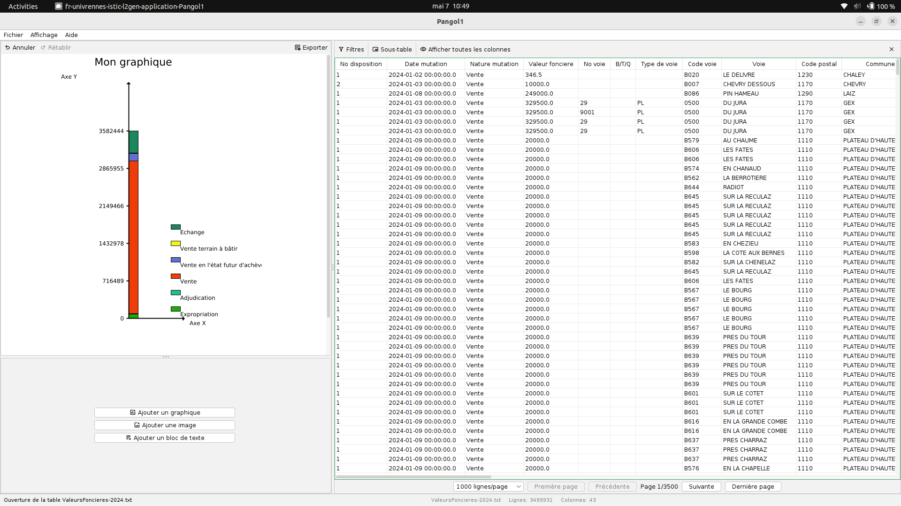

<h1 style="display: flex; align-items: center; gap: 12px;">

Pangol1
</h1>

> Generate SVG charts from data files.


[](https://github.com/jules1univ/Pangol1/actions/workflows/build-jar.yml)
[](https://github.com/jules1univ/Pangol1/actions/workflows/test-junit.yml)



## Setup

### Logiciels nécessaires

- **VS Code**
- **Git**
- **Java JDK 21**

## Installation

### Cloner le dépôt

```bash
git clone https://github.com/jules1univ/Pangol1.git
cd Pangol1
```

### Ouvrir le projet

- Ouvrir le dossier `Pangol1` dans **VS Code**
- Vérifier que le JDK est bien configuré (`java --version`)

## Libraries

Les bibliothèques utilisées dans ce projet sont:

- **FlatLaf**: Pour une interface utilisateur moderne et agréable.
- **DuckDB JDBC**: Pour la gestion de la base de données en mémoire.
- **JUnit**: Pour les tests unitaires.
- **Batik**: Pour la conversion des graphiques SVG en images PNG.
- **OpenHTMLToPDF**: Pour la conversion des rapports HTML en PDF.
- **JavaFX**: Pour l'affichage du rapport final en HTML.

## Lancer l'application

Après avoir cloné et ouvert le projet:

```bash
javac -cp "lib/*" application/Pangol1.java
```

Ou, si un JAR est construit via le workflow:

```bash
java -jar Pangol1.jar
```

## Contribution

**Membres**: [Liste des membres](docs/MEMBERS.md)

**Contribution**: [Comment contribuer](CONTRIBUTING.md)

**Documentation**: [Documentation complète](docs/DOCUMENTATION.md)

## License

Ce projet est sous licence MIT. Voir le fichier [LICENSE](LICENSE) pour plus de détails.
